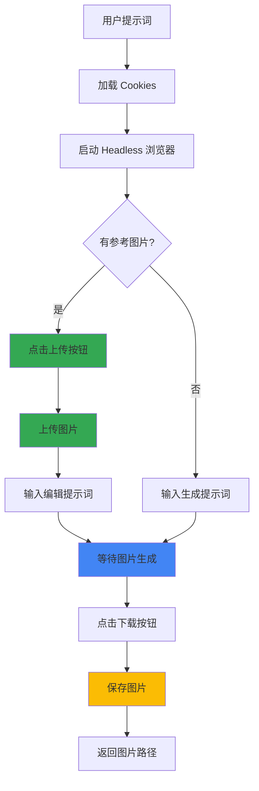

# Gemini Imagen 3 图片生成与编辑

## Overview

使用 Google Gemini 的 Imagen 3 模型生成高质量 AI 图片，或基于现有图片进行编辑修改。通过 Playwright 自动化操作 Gemini 网页界面。

**Key capabilities:**
- 使用 Imagen 3 模型生成高质量图片
- **基于参考图片生成新图片**
- **编辑现有图片（修改颜色、添加/删除元素等）**
- 支持中英文提示词
- 自动下载生成的图片
- 支持代理访问

## Architecture



## Quick Start

### 生成新图片

```bash
# 首次使用：需要 cookies
python3 gemini_imagen.py \
  --cookies ~/cookies.json \
  --prompt "美女在林间蹦跑" \
  --output ~/generated.png

# 之后使用：自动加载 cookies
python3 gemini_imagen.py \
  --prompt "赛博朋克城市" \
  --output ~/cyberpunk.png
```

### 基于图片生成/编辑 🆕

```bash
# 基于参考图片生成新图片
python3 gemini_imagen.py \
  --image ~/cat_sleeping.png \
  --prompt "小猫醒了抬起了头" \
  --output ~/cat_awake.png

# 编辑图片中的元素
python3 gemini_imagen.py \
  --image ~/phone.jpg \
  --prompt "将图中的手机变成黑色" \
  --output ~/black_phone.png
```

### 使用代理

```bash
# 指定代理服务器
python3 gemini_imagen.py \
  --prompt "赛博朋克城市夜景" \
  --proxy http://127.0.0.1:7897

# 不使用代理
python3 gemini_imagen.py \
  --prompt "水墨画风格的山水" \
  --no-proxy
```

## 参数说明

| 参数 | 简写 | 必需 | 默认值 | 说明 |
|------|------|------|--------|------|
| `--cookies` | `-c` | ❌ | - | Google cookies JSON 文件路径（首次使用必需，之后自动加载） |
| `--prompt` | `-p` | ✅ | - | 图片生成/编辑提示词 |
| `--output` | `-o` | ❌ | `./gemini_image.png` | 输出文件路径 |
| `--image` | `-i` | ❌ | - | 参考图片路径（用于图片编辑） |
| `--proxy` | - | ❌ | `http://127.0.0.1:7897` | 代理服务器地址 |
| `--no-proxy` | - | ❌ | - | 不使用代理 |
| `--timeout` | `-t` | ❌ | `60` | 等待生成的超时秒数 |
| `--save-cookies` | - | ❌ | - | 强制保存 cookies 到持久化存储（首次使用会自动保存） |
| `--cookies-store` | - | ❌ | `data/cookies.json` | 自定义 cookies 存储路径 |

## 图片编辑用例 🎨

### 1. 颜色修改
```bash
--image product.jpg --prompt "将产品颜色改为红色"
--image car.jpg --prompt "把车身喷成哑光黑"
```

### 2. 元素添加
```bash
--image room.jpg --prompt "在桌子上添加一盆绿植"
--image portrait.jpg --prompt "给人物戴上太阳镜"
```

### 3. 元素移除
```bash
--image photo.jpg --prompt "移除背景中的路人"
--image landscape.jpg --prompt "去掉天空中的电线"
```

### 4. 风格转换
```bash
--image photo.jpg --prompt "转换为油画风格"
--image selfie.jpg --prompt "变成动漫风格"
```

### 5. 场景延续
```bash
--image cat_sleeping.jpg --prompt "小猫醒来伸懒腰"
--image sunrise.jpg --prompt "太阳完全升起后的样子"
```

## Cookies 持久化机制 🔄

**首次使用**时需要提供 `--cookies` 参数，脚本会自动将 cookies 保存到 `data/cookies.json`：

```bash
# 首次使用：需要提供 cookies 文件
python3 gemini_imagen.py \
  --cookies ~/my_google_cookies.json \
  --prompt "美女在林间蹦跑"
  
# 输出：
# Loading cookies from /home/user/my_google_cookies.json...
# Cookies saved to store: /path/to/skills/gemini-imagen/data/cookies.json
```

**之后使用**时无需再提供 `--cookies`，会自动从 `data/cookies.json` 加载：

```bash
# 之后使用：自动加载已保存的 cookies
python3 gemini_imagen.py \
  --prompt "赛博朋克城市夜景"
  
# 输出：
# No cookies file specified, checking store: data/cookies.json
# Loaded cookies from store (saved: 2026-02-10T11:30:00+0800)
```

**Cookies 过期处理**：
- 如果检测到 cookies 已过期（登录失败），脚本会自动删除 `data/cookies.json`
- 提示你使用 `--cookies` 提供新的 cookies 文件
- 新 cookies 会自动保存，替换旧的

**强制保存新 cookies**（覆盖现有存储）：

```bash
python3 gemini_imagen.py \
  --cookies ~/new_cookies.json \
  --save-cookies \
  --prompt "测试新 cookies"
```

**自定义存储位置**：

```bash
python3 gemini_imagen.py \
  --cookies ~/cookies.json \
  --cookies-store ~/my_custom_store.json \
  --prompt "使用自定义存储路径"
```

---

## Cookies 获取方法

### 方法一：使用浏览器扩展

1. 在 Chrome 中安装 "EditThisCookie" 或 "Cookie-Editor" 扩展
2. 访问 https://gemini.google.com 并登录
3. 点击扩展图标，选择 "导出" 或 "Export"
4. 保存为 JSON 文件

### 方法二：使用开发者工具

1. 访问 https://gemini.google.com 并登录
2. 按 F12 打开开发者工具
3. 切换到 "Application" → "Cookies"
4. 使用脚本导出（需要手动格式化）

### Cookies 格式要求

导出的 JSON 应为数组格式：
```json
[
  {
    "name": "SID",
    "value": "xxx...",
    "domain": ".google.com",
    "path": "/",
    "secure": false,
    "httpOnly": true,
    "sameSite": "no_restriction",
    "expirationDate": 1804565729
  },
  ...
]
```

## 常见问题

### Cookies 过期

**症状:** 脚本报错 "Not logged in! Cookies may be expired."

**解决方案:**
1. 在浏览器中重新登录 Gemini
2. 重新导出 cookies
3. 使用 `--cookies` 提供新的 cookies 文件（会自动保存并覆盖旧的）

```bash
# 提供新 cookies 后会自动替换旧存储
python3 gemini_imagen.py \
  --cookies ~/fresh_cookies.json \
  --prompt "测试"
```

### 图片上传失败

**症状:** 显示 "WARNING: Could not upload reference image"

**解决方案:**
1. 确保图片文件存在且路径正确
2. 检查图片格式（支持 jpg, png, webp）
3. 图片大小不要超过 20MB

### 网络连接问题

**症状:** 超时或连接失败

**解决方案:**
1. 检查代理是否正常工作
2. 尝试使用 `--no-proxy` 直接连接
3. 增加 `--timeout` 值

### 图片下载失败

**症状:** 脚本完成但没有图片

**解决方案:**
1. 增加 `--timeout` 等待更长时间
2. 检查输出目录是否有写入权限
3. 查看 `*_debug.png` 截图确认图片是否已生成

## 依赖

- Python 3.6+
- `playwright` 包
- Chromium 浏览器（playwright 自动安装）

### 安装依赖

```bash
pip install playwright
playwright install chromium
```

## 注意事项

1. **Cookies 有效期**: Google cookies 通常有效期较长，但可能因安全原因提前失效
2. **生成限制**: Gemini 可能对图片生成有频率限制
3. **内容政策**: 请遵守 Google 的使用条款，不要生成违规内容
4. **代理需求**: 某些地区需要代理才能访问 Gemini
5. **图片编辑**: 编辑效果取决于 Imagen 3 对提示词的理解，复杂编辑可能需要多次尝试

## 示例提示词

### 生成新图片
```bash
--prompt "年轻女性在樱花树下微笑"
--prompt "日落时分的富士山倒影"
--prompt "梵高风格的星空城市"
--prompt "未来城市的空中交通"
```

### 编辑现有图片
```bash
--image photo.jpg --prompt "将背景换成海滩"
--image portrait.jpg --prompt "换成微笑的表情"
--image product.jpg --prompt "添加节日装饰"
--image room.jpg --prompt "把白天改成夜晚"
```
